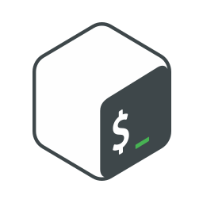
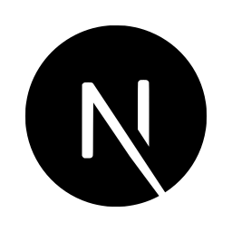
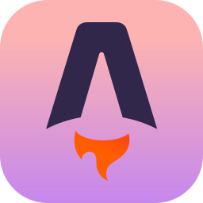

<!--
version: 3.1.1
-->

# 🛡️ ZocketZero
**Red Team Cybersecurity | Linux Enthusiast | Full-Stack Developer**

---

### 🚀 About Me
Cybersecurity professional specializing in **Red Teaming & Offensive Security**. 
Passionate about **Linux**, Open Source, and crafting secure, efficient code.

[Resume](https://resume.nawasan.dev) • [Mastodon](https://infosec.exchange/@zocketzero) • [IRC: #ZocketZero @ Libera.Chat](irc://irc.libera.chat/ZocketZero)

---

### 🛠️ Technologies & Tools

#### 💻 Languages & Core

  
  
  
  
  
  
  

#### 🌐 Web & Frameworks

  
  
  
  
  
  
  

#### 🔧 Infrastructure & Databases

  
  
  
  
  
  
  
  

---

### 📁 Where to find my work

| Platform | Link |
| :---: | :---: |
| **GitHub** | [github.com/ZocketZero](https://github.com/ZocketZero) |
| **GitLab** | [gitlab.com/ZocketZero](https://gitlab.com/ZocketZero) |
| **Debian** | [salsa.debian.org/ZocketZero](https://salsa.debian.org/ZocketZero) |
| **Crates.io** | [crates.io/users/ZocketZero](https://crates.io/users/ZocketZero) |
| **NPM** | [npmjs.com/~arikato111](https://www.npmjs.com/~arikato111) |
| **PyPI** | [pypi.org/user/arikato111/](https://pypi.org/user/arikato111/) |

---

### 🎯 Cybersecurity & Learning

  
  

---

### 📊 GitHub Stats

  
  

---

### 💭 Quotes
> *"If someone asks for your patience, they are asking for your surrender."*

> *"If you know the enemy and know yourself, you need not fear the result of a hundred battles."*
> — **Sun Tzu**, *The Art of War*

---

