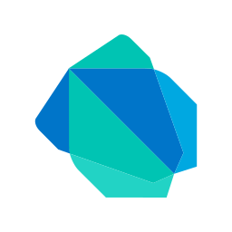
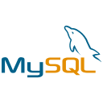
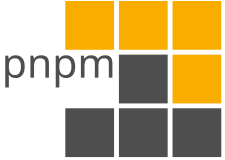
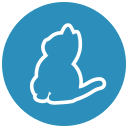

<!--
version: 3.1.1
-->

# ZocketZero

Hello friend! 👋
I'm a **Cybersecurity Red Team** professional, **Linux** enthusiast, and passionate **Developer**.

&nbsp;&nbsp;
&nbsp;&nbsp;
&nbsp;&nbsp;
&nbsp;&nbsp;

 

---

### 🚀 Tech Stack

**Languages**
 
&nbsp;
&nbsp;
&nbsp;
&nbsp;
&nbsp;
&nbsp;
&nbsp;

 

**Frontend**
 
&nbsp;
&nbsp;
&nbsp;
&nbsp;
&nbsp;
&nbsp;
&nbsp;
&nbsp;

 

**Backend & Databases**
 
&nbsp;
&nbsp;
&nbsp;
&nbsp;

 

**Tools & DevOps**
 
&nbsp;
&nbsp;
&nbsp;
&nbsp;
&nbsp;
&nbsp;

 

---

### 🔗 Quick Links

| Category | Links |
| :--- | :--- |
| **Source Code** | [Github](https://github.com/ZocketZero) • [Gitlab](https://gitlab.com/ZocketZero) • [Debian Salsa](https://salsa.debian.org/ZocketZero) |
| **Libraries** | [crates.io](https://crates.io/users/ZocketZero) • [npm](https://www.npmjs.com/~arikato111) • [PyPI](https://pypi.org/user/arikato111/) |
| **Learning** | [TryHackMe](https://tryhackme.com/p/ZocketZero) • [HackTheBox](https://app.hackthebox.com/users/2300894) |
| **Socials** | [Website](https://nawasan.dev) • [Mastodon](https://infosec.exchange/@zocketzero) • [Resume](https://resume.nawasan.dev) |

 

### 💬 IRC
Network: `Libera.Chat` (`irc.libera.chat`) &nbsp; | &nbsp; Channel: `#ZocketZero`

 

## 💭 Quotes

> If someone asks for your patience, they are asking for your surrender

> "If you know the enemy and know yourself, you need not fear the result of a hundred battles. If you know yourself but not the enemy, for every victory gained you will also suffer a defeat."
>
> — *Sun Tzu's The Art of War*

 

---

